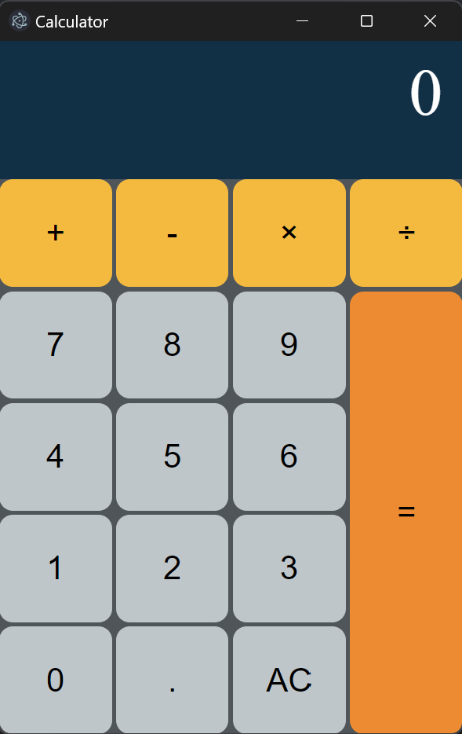

# Calculator

This is a learning project for Java Script and Electron

The goal is to create a simple Calculator

This project is not intended for any usecase

## Following:

-https://www.cssacademy.com/blog/create-a-calculator-in-html-and-css

-https://zellwk.com/blog/calculator-part-1/

